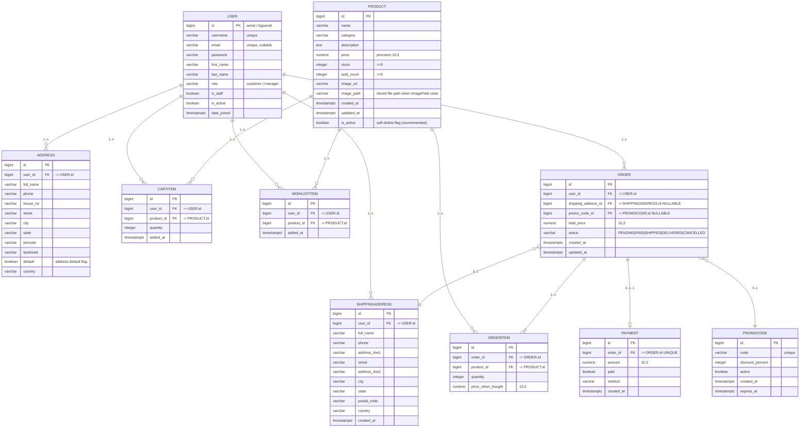

## 🥬 Grocery Store Management System

A complete **end-to-end Grocery Store Management web application** built with **Django + PostgreSQL**, featuring customer shopping, cart management, secure checkout, order tracking, and a powerful manager dashboard with live sales analytics and inventory controls.

---

### 🧩 Key Features

#### 👩‍💻 Customer Side

* 🛍️ Browse and search products by category, price, or keyword
* 🧺 Add to cart, update quantity, and manage wishlist
* 📦 Place orders with address and promo code integration
* 💳 Simulated payment system
* 📜 View order history and order details

#### 🧑‍💼 Manager Side

* 🧾 Manager login and secure access
* 📊 Dashboard showing total products, orders, and sales
* 🔢 Low stock alert system
* ➕ Add/Edit/Delete/Restock products
* 🧮 View monthly and yearly sales analytics (interactive charts)
* 📦 View and update order statuses (Pending → Delivered)
* 💰 Sales & Order management page with revenue summary

---

### ⚙️ Tech Stack

| Category           | Technologies Used                                                |
| ------------------ | ---------------------------------------------------------------- |
| **Backend**        | Django 5.2, Python 3.12                                          |
| **Database**       | PostgreSQL                                                       |
| **Frontend**       | HTML5, CSS3, Bootstrap 5, Chart.js                               |
| **API**            | Django REST Framework (for cart & promo code)                    |
| **Authentication** | Django’s built-in Auth system (custom roles: Manager & Customer) |
| **ORM**            | Django ORM                                                       |
| **Other Tools**    | Django Filters, Messages Framework, Crispy Forms (optional)      |

---

### 🏗️ Database Design (PostgreSQL ER Diagram)



---

### 📂 Project Structure

```
groceryapp/
├── accounts/               # User accounts, login, register, address management
├── products/               # Product CRUD, manager panel, dashboard
├── orders/                 # Cart, orders, wishlist, checkout, payments
├── templates/
│   ├── base.html           # Shared layout
│   ├── manager/            # Manager templates (dashboard, reports, etc.)
│   ├── orders/             # Cart, checkout, order detail
│   ├── products/           # Product list, detail
│   └── accounts/           # Login, register, address forms
├── static/                 # CSS, JS, and images
├── manage.py
└── README.md
```

---

### 🧠 Core Functional Flow

#### 🛍️ For Customers

1. Register/Login
2. Browse products
3. Add to cart
4. Apply promo code (optional)
5. Choose address and checkout
6. Place order and simulate payment
7. View order history

#### 🧑‍💼 For Managers

1. Login as `role = 'manager'`
2. Access manager dashboard
3. Manage products (add/edit/restock/delete)
4. View low stock items
5. View all orders and update their statuses
6. Access analytics dashboard for sales overview

---

### 💾 Setup Instructions

#### 1. Clone the Repository

```bash
git clone https://github.com/yourusername/grocery-store-django.git
cd grocery-store-django
```

#### 2. Create a Virtual Environment

```bash
python -m venv venv
source venv/bin/activate     # On Linux/Mac
venv\Scripts\activate        # On Windows
```

#### 3. Install Dependencies

```bash
pip install -r requirements.txt
```

#### 4. Configure PostgreSQL Database

Create a new database in PostgreSQL and update `settings.py`:

```python
DATABASES = {
    'default': {
        'ENGINE': 'django.db.backends.postgresql',
        'NAME': 'grocerydb',
        'USER': 'postgres',
        'PASSWORD': 'yourpassword',
        'HOST': 'localhost',
        'PORT': '5432',
    }
}
```

#### 5. Run Migrations

```bash
python manage.py makemigrations
python manage.py migrate
```

#### 6. Create a Superuser

```bash
python manage.py createsuperuser
```

#### 7. Run the Server

```bash
python manage.py runserver
```

Visit **[http://127.0.0.1:8000/](http://127.0.0.1:8000/)** 🎉

---

### 📊 Manager Dashboard Overview

* **Overview Page:** Displays total products, low stock count, total sales, and top sellers
* **Sales Dashboard:** Monthly and yearly analytics with live Chart.js graphs
* **Orders Management:** See all customer orders and update statuses inline
* **Low Stock Alerts:** Automatically highlights items with stock < 5

---

### 🧩 Future Enhancements

* ✅ Export sales data to CSV
* ✅ Generate invoice PDF for each order
* ✅ Email notifications for order status updates
* ✅ Integrate Razorpay/Stripe for live payments
* ✅ Add customer analytics (top buyers, repeat customers)
* ✅ Large product upload
* ✅ Sells analytics (MONTHLY / Yearly)
* 

---

### 👨‍💻 Author

**Yami (Cybersecurity & Software Engineer)**

> A complete Django + PostgreSQL E-Commerce project — built from scratch with love, logic, and coffee ☕

---

### 📜 License

MIT License © 2025 — Free to use, modify, and share with attribution.

---
